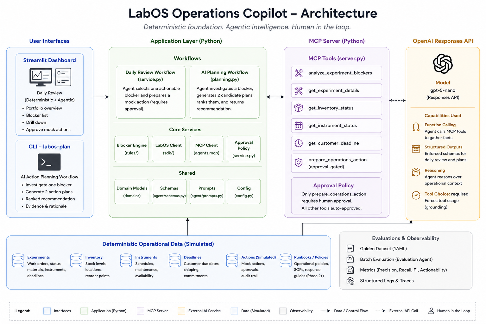

# LabOS Operations Copilot

[](https://github.com/Riddhikshah21/labos-operations-copilot/actions/workflows/ci.yml)
[](https://www.python.org/)
[](LICENSE)

An **MCP-enabled, policy-constrained laboratory operations copilot** that detects operational blockers, investigates them through typed tools, and generates grounded remediation options.

The system combines:

- **OpenAI Agents SDK** for intent interpretation, tool orchestration, prioritization, and action-plan generation
- **Model Context Protocol (MCP)** for standardized access to operational tools
- **Deterministic Python services** for blocker detection, severity, grounding, policy enforcement, and mock execution
- **Human approval** before any simulated operational action

> **Simulation only:** all experiments, materials, instruments, deadlines, and actions use synthetic fixture data. No real laboratory system is connected or modified.

---

## Why this project

Automated laboratories produce operational signals across experiments, materials, instruments, and customer deadlines. Operators need to answer:

> **Which experiments need attention, why, and what should happen next?**

LabOS Operations Copilot provides two related AI workflows:

1. **Daily operations review** — identifies and prioritizes experiments requiring attention.
2. **Grounded action planning** — investigates one validated blocker and generates two ranked remediation alternatives.

The LLM is not the operational source of truth. It orchestrates tools and proposes plans; deterministic code verifies facts, policy, and evidence.

---

## Architecture




### Responsibility boundary

| Layer | Responsibility |
|---|---|
| AI agents | Interpret requests, select MCP tools, prioritize findings, generate and rank action alternatives |
| MCP server | Expose typed operational capabilities through a standard tool protocol |
| Blocker engine | Calculate factual blockers and severity |
| Plan validator | Enforce experiment identity, blocker identity, permitted actions, evidence references, and required tool use |
| Action service | Create a simulated action only after explicit approval |
| Streamlit UI | Present the daily review, evidence, traces, and approval workflow |

The guiding pattern is:

```text
LLM proposes → Python validates → Human authorizes
```

---

## AI workflows

### 1. Daily operations review

The daily-review agent:

1. receives a natural-language operations question;
2. calls `analyze_active_experiments` through MCP;
3. selects the highest-priority validated finding;
4. returns a structured operations brief;
5. records the MCP tools used.

Python independently reruns the blocker analysis and constructs the factual brief. This prevents the model from changing findings, severity, evidence, or experiment state.

### 2. Grounded action planning

The action-planning agent:

1. analyzes a supplied experiment and blocker;
2. retrieves experiment details;
3. gathers category-specific context such as inventory, instrument, or deadline records;
4. generates exactly **two distinct action candidates**;
5. compares urgency, expected impact, operational cost, and trade-offs;
6. selects one recommended candidate;
7. returns structured evidence IDs and confidence.

Python then validates:

- experiment and rule identity;
- blocker category;
- allowed action type;
- mandatory evidence IDs;
- unsupported identifiers;
- required investigative MCP tool calls.

The planner is not allowed to call the execution tool and cannot claim that an action was performed.

### 3. Approval-gated mock action

The existing mock-action workflow requires explicit approval before calling `prepare_operations_action`.

All actions are simulated. The project does not:

- control instruments;
- submit or modify experiments;
- trigger procurement;
- contact customers;
- write to production systems.

---

## Deterministic blocker rules

The blocker engine evaluates:

- **Stage delay** — a stage exceeds its expected duration
- **Inventory unavailable** — a required material is out of stock
- **Inventory below minimum** — available quantity is below the configured minimum
- **Instrument unavailable** — a required instrument is offline or in maintenance
- **Deadline risk** — a customer deadline has passed or is approaching risk thresholds

Multiple findings may be attached to the same experiment.

---

## MCP tools

| Tool | Purpose | Approval |
|---|---|---:|
| `list_active_experiments` | List active experiments | No |
| `get_experiment_details` | Retrieve experiment and related operational context | No |
| `get_inventory_status` | Retrieve one material record | No |
| `get_instrument_status` | Retrieve one instrument record | No |
| `get_customer_deadline` | Retrieve an experiment deadline | No |
| `analyze_experiment_blockers` | Analyze one experiment deterministically | No |
| `analyze_active_experiments` | Analyze all active experiments | No |
| `prepare_operations_action` | Create a simulated action | **Yes** |

---

## Technology

- Python 3.12
- Pydantic and pydantic-settings
- OpenAI Agents SDK
- MCP Python SDK / FastMCP
- Streamlit
- Pytest
- MyPy strict mode
- Ruff
- Docker
- GitHub Actions

---

## Repository structure

```text
.
├── app.py
├── fixtures/
│   ├── experiments.json
│   ├── inventory.json
│   ├── instruments.json
│   └── deadlines.json
├── evaluations/
│   ├── cases.json
│   └── report.md
├── src/labos_copilot/
│   ├── actions/       # Approval-gated simulated actions
│   ├── agent/         # Daily-review and action-planning agents
│   ├── data/          # Fixture loading
│   ├── domain/        # Typed domain models
│   ├── evaluation/    # Offline and live evaluation runners
│   ├── mcp/           # MCP server and tool service
│   ├── rules/         # Deterministic blocker engine
│   ├── sdk/           # Typed LabOS-style data SDK
│   └── ui/            # Streamlit presentation helpers
├── tests/
├── Dockerfile
├── Makefile
└── pyproject.toml
```

---

## Installation

```bash
git clone https://github.com/Riddhikshah21/labos-operations-copilot.git
cd labos-operations-copilot

python3.12 -m venv .venv
source .venv/bin/activate

python -m pip install --upgrade pip
python -m pip install -e '.[dev]'
cp .env.example .env
```

Configure `.env`:

```dotenv
OPENAI_API_KEY=your_openai_api_key
OPENAI_MODEL=gpt-5-nano
LABOS_FIXTURES_DIR=fixtures
AGENT_MAX_TURNS=5
```

Never commit `.env` or `.streamlit/secrets.toml`.

---

## Usage

### Streamlit dashboard

```bash
python -m streamlit run app.py
```

The dashboard runs the daily operations review, displays deterministic findings and evidence, shows the agent tool trace, and provides an explicit approval flow for mock actions.

### Daily-review agent CLI

```bash
labos-agent "Which experiments need attention today?"
```

A request that explicitly asks to prepare an action may trigger a terminal approval prompt.

### Grounded AI planner CLI

```bash
labos-plan \
  EXP-103 \
  inventory-out-of-stock \
  --as-of 2026-07-26T00:00:00Z
```

Expected planner behavior:

```text
analyze_experiment_blockers
→ get_experiment_details
→ get_inventory_status
→ generate two distinct candidates
→ rank one recommendation
→ validate evidence and policy
```

The command prints the structured plan set and the MCP tools used. It does not execute an action.

### MCP server

```bash
labos-mcp
```

The server runs over standard input/output for use by the Agents SDK MCP client.

---

## OpenAI API usage

| Workflow | Calls the OpenAI API? |
|---|---:|
| Streamlit AI review | Yes |
| `labos-agent` | Yes |
| `labos-plan` | Yes |
| `labos-evaluate --live-agent` | Yes |
| MCP server by itself | No |
| Deterministic blocker engine | No |
| `labos-evaluate` without `--live-agent` | No |
| Unit tests | No |

---

## Evaluation

Run deterministic evaluations:

```bash
labos-evaluate
```

Run optional live-agent evaluations:

```bash
labos-evaluate --live-agent
```

The committed evaluation report records:

- **9/9 offline cases passed**
- **100% blocker precision**
- **100% blocker recall**
- live validation of MCP tool selection
- live validation of rejected action approval

See [`evaluations/report.md`](evaluations/report.md).

The current offline suite evaluates deterministic blocker detection and mock-action policy. The planning workflow has unit coverage for its schemas, evidence normalization, and validation; expanding live planning-quality evaluations is a natural next step.

---

## Quality checks

```bash
python -m ruff format --check .
python -m ruff check .
python -m mypy src tests
python -m pytest
labos-evaluate
```

Or:

```bash
make check
make test
make evaluate
```

GitHub Actions runs formatting, linting, strict type checking, tests, and offline evaluations on pull requests.

---

## Docker

Build:

```bash
docker build -t labos-operations-copilot .
```

Run:

```bash
docker run --rm \
  -p 8501:8501 \
  --env-file .env \
  labos-operations-copilot
```

Open:

```text
http://localhost:8501
```

---

## Design decisions

### Why not use the LLM to detect blockers?

Inventory quantities, instrument state, elapsed durations, and deadline risk are factual operational calculations. They should be reproducible, testable, and auditable.

### What does the AI contribute?

The agents provide:

- natural-language intent handling;
- multi-step MCP tool orchestration;
- priority selection;
- contextual investigation;
- structured generation of alternative remediation plans;
- trade-off analysis and ranking.

### Why validate model output again?

Structured output does not guarantee factual grounding. The validator checks model-generated plans against deterministic findings, allowed actions, known identifiers, and observed tool usage before a plan is accepted.

---

## Current limitations

- All records are simulated fixtures.
- The action planner currently retrieves operational records but does not yet use a runbook or SOP knowledge base.
- The planner produces validated plans through the CLI; the Streamlit UI currently exposes the daily-review and mock-action workflows.
- The mock action service remains a simulation and has no production integrations.
- No scientific conclusions or experimental-design recommendations are generated.

---
